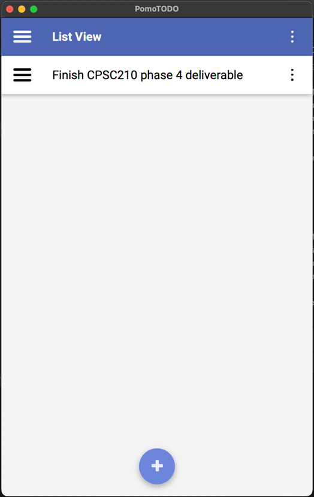
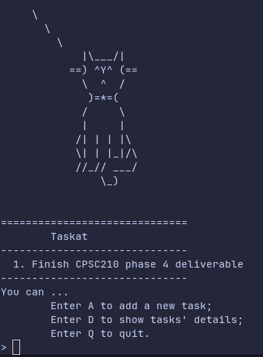

# taskat

A TODO list that is customizable with a date and description.
GUI is available as well, supplied with the JavaFX library.
The GUI structure was supplied by the course instructors, with core pieces left out.

The program saves the TODO list into a JSON file, which it then parses whenever required.

| Graphical UI                                     | Terminal UI                                          |
|--------------------------------------------------|------------------------------------------------------|
|  |  |
